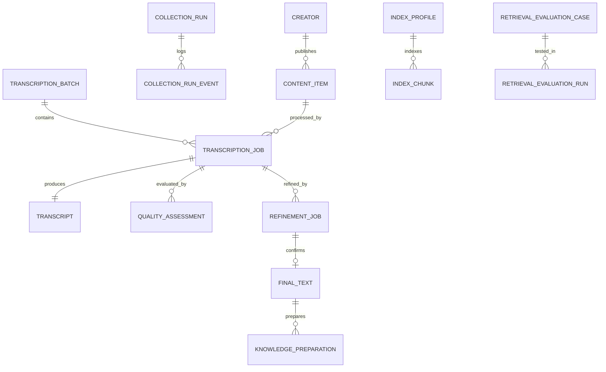
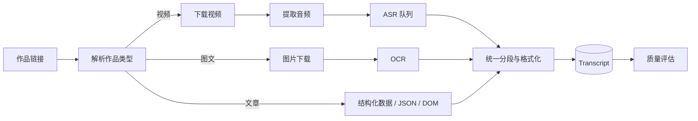

# CareerAgent Architecture

## 1. 设计目标

CareerAgent 采用“模块化单体 + 本地任务系统”的结构，优先解决单用户本地运行、复杂依赖安装、公开内容采集、批量文本化、人工确认和检索实验等问题。

当前不拆微服务，原因是：

- 单用户本地应用不需要承担服务发现、分布式事务和多环境部署成本；
- ASR/OCR 模型对象需要在单进程中复用，避免重复加载；
- SQLite 和本地文件系统足以支撑当前规模；
- 业务模块通过稳定的数据模型和 Service 边界解耦，后续可以按需拆分。

## 2. 分层结构

```text
Web UI / API
    ↓
Router / Schema
    ↓
Application Service
    ↓
Repository / Provider / Engine
    ↓
SQLite / HTTP / Playwright / Local Models / External APIs
```

### Web/API 层

- `app/web`：本地单页工作台；
- `app/api/v1`：API 汇总、系统与存储接口；
- 各模块 `router.py`：输入校验、响应模型和错误映射。

### 业务服务层

- `collection.service`：采集任务编排、API/浏览器降级、批量自然日窗口；
- `transcription.service` / `batch`：内容自动分流、批量队列、失败恢复；
- `refinement.service`：清洗、纠错、版本与最终稿；
- `knowledge_base.service`：知识准备、索引、检索、比较和评测。

### 基础设施层

- Repository：SQLAlchemy Async 数据访问；
- Provider：抖音接口、浏览器与内容解析；
- Engine：SenseVoice、Paraformer、Whisper、OCR、纠错模型；
- Client：Embedding、Reranker、OpenAI-compatible API；
- Core：日志、存储、密钥保护、运行环境、GPU DLL 路径。

## 3. 数据主线



核心原则：

- 原始数据不覆盖；
- 每个处理阶段保留来源、版本和 Trace ID；
- 同一作品通过平台 ID 幂等更新；
- 点赞等互动变化与正文语义变化分离；
- 下游只处理新增或语义版本变更的数据。

## 4. 采集模块

```text
DouyinHybridProvider
├── FastApiProvider
│   ├── Cookie 快照
│   ├── 签名参数
│   ├── 分页与指数退避
│   └── 视频/图文/文章归一化
└── BrowserProvider
    ├── 可见登录窗口
    ├── 主页网络响应监听
    ├── DOM 兜底
    └── 人工验证码处理
```

浏览器兜底只用于目标主页，不逐条打开作品详情页，以控制速度和错误跳转。

## 5. 文本化流水线



批量任务采用：

- 受控并发解析与下载；
- 同一 ASR 模型单例复用；
- GPU 推理锁；
- 子任务独立失败与重试；
- 程序重启后恢复排队任务。

## 6. 文本治理

文本版本链路：

```text
raw_text
→ cleaned_text
→ terminology_text
→ model_or_api_refined_text
→ human_final_text
```

每次修改记录：

- 处理模式；
- 模型或 API；
- 修改项与风险项；
- 数字、URL、版本号安全校验；
- 耗时、设备、错误和 Trace ID。

## 7. 知识库检索

### 索引

- 文档切分在正式入库时统一完成；
- 每个 Index Profile 绑定 Embedding 模型和参数；
- 支持并存多个索引，用于横向比较；
- 文档删除或最终稿变化时标记索引 stale。

### 检索策略

- `dense`：纯向量相似度；
- `hybrid`：Dense 与 BM25 查询内归一化后线性融合；
- `rrf`：Dense 与 BM25 排名的 Reciprocal Rank Fusion；
- 多来源问题可启用 MMR 多样化；
- Reranker 支持关闭、仅低置信单选、仅单选或全部问题。

### 评测

- 单选问题：关注首个正确文档排名和 Hit@K；
- 多选问题：关注 Recall@K、Precision@K 和 Full Hit；
- 记录检索策略、权重、RRF 常数、MMR、Reranker 作用范围、耗时和 API 请求。

## 8. 可观测性

每个主要任务包含：

- `run_id` / `job_id`；
- `trace_id`；
- 状态与阶段；
- 结构化错误码；
- 开始/结束时间和耗时；
- 模型、设备、请求次数与流量；
- JSONL 程序日志和可导出诊断 ZIP。

日志层会对 Cookie、Token、签名参数和 API Key 脱敏。

## 9. 存储边界

代码仓库与运行数据分离：

```text
Repository                    App Data Directory
├── app/                      ├── database/
├── tests/                    ├── browser/
├── docs/                     ├── logs/
└── launch scripts            ├── media/
                              ├── models/
                              └── settings/
```

用户可以分别选择运行数据目录和导出目录。媒体默认作为临时缓存；数据库、文本、质量评估和最终稿长期保存。

## 10. 后续拆分方向

达到以下条件后再考虑服务化：

- 多用户并发或远程部署；
- 需要独立伸缩 GPU Worker；
- 数据量超出 SQLite 合理范围；
- 需要基于消息队列的可靠任务调度；
- 需要租户权限、配额和审计。

可演进为：PostgreSQL + Redis/任务队列 + 独立采集 Worker + GPU Worker + 对象存储 + OpenTelemetry/Langfuse。
