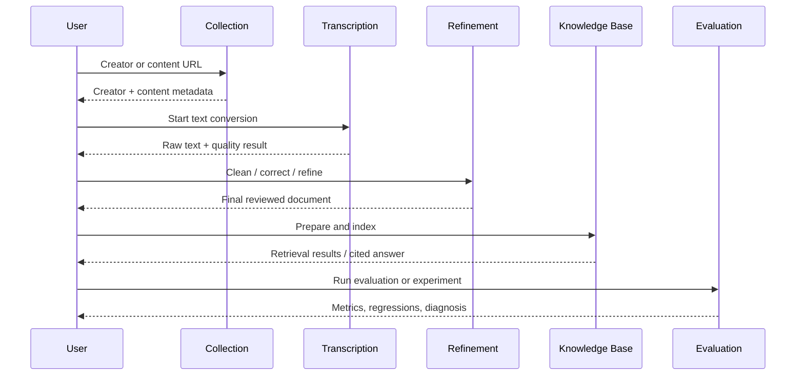

# CareerAgent architecture

## 1. Architectural style

CareerAgent uses a **modular monolith**. A single FastAPI process is easier to install and debug for a local-first personal application, while clear module boundaries keep later service extraction possible.

```text
UI / CLI
   ↓
FastAPI routers
   ↓
Domain services
   ↓
Providers / engines / repositories
   ↓
SQLite, local files, browser sessions, model runtimes and remote APIs
```

Rules:

- platform-specific behavior stays inside Provider modules;
- routers validate and translate HTTP requests but do not own business logic;
- services orchestrate workflows and stable error codes;
- repositories own database access;
- heavyweight models are loaded lazily;
- raw data and derived text versions are stored separately;
- every long-running workflow exposes a task ID or Trace ID.

## 2. Modules

### `collection`

Responsible for creator/profile parsing, public work discovery, pagination, browser fallback, content-type classification, idempotent persistence, incremental collection, diagnostics, and run events.

### `transcription`

Responsible for content resolution, media download, FFmpeg extraction, SenseVoice/Paraformer/Whisper execution, OCR, article extraction, batch processing, quality evaluation, CER, and document export.

### `refinement`

Responsible for deterministic cleanup, terminology normalization, OpenAI-compatible rewriting, Ollama local refinement, safety validation, manual final drafts, and knowledge-preparation documents.

### `knowledge_base`

Responsible for parent-child chunking, embedding, index metadata, Dense/BM25/hybrid/RRF retrieval, MMR, local/API reranking, cited answers, caches, evaluation datasets, regression baselines, failure analysis, and retrieval/RAG optimization.

### `local_models`

Responsible for Ollama portable installation, model directory configuration, service startup, model pulls, and chat/embedding smoke tests.

## 3. Data flow



## 4. Retrieval pipeline

```text
Query classification
→ query embedding / BM25 preparation
→ Dense, BM25, weighted hybrid or RRF
→ optional MMR
→ conditional local/API reranking
→ parent-chunk recovery
→ overlap deduplication and source limits
→ score-cliff stop and character budget
→ low-confidence evidence gate
→ cited answer generation
```

Caches are keyed by index version and configuration. Rebuilding or changing an index invalidates dependent query, corpus, ranking, context, and answer caches.

## 5. Persistence

SQLite stores business records and index metadata. Large media files, model weights, browser profiles, logs, and exports live under configurable local directories and are not committed to Git.

Important identities:

- creator: `platform + platform_user_id`;
- content: `platform + platform_content_id`;
- collection run: run ID + trace ID;
- transcription/refinement/index/evaluation runs: stable database IDs and configuration snapshots.

## 6. Error handling and observability

User-facing failures use stable error codes with stage, retryability, suggestion, and technical detail. Structured logs are rotated and sensitive fields are redacted. Diagnostic exports intentionally exclude cookies, API keys, browser profiles, model files, and private databases.

## 7. Future extraction points

If scale requires service separation, the safest boundaries are:

1. collector workers;
2. media/ASR workers;
3. model inference workers;
4. retrieval and evaluation workers.

The current modular monolith avoids premature distributed-system complexity while preserving these boundaries.
