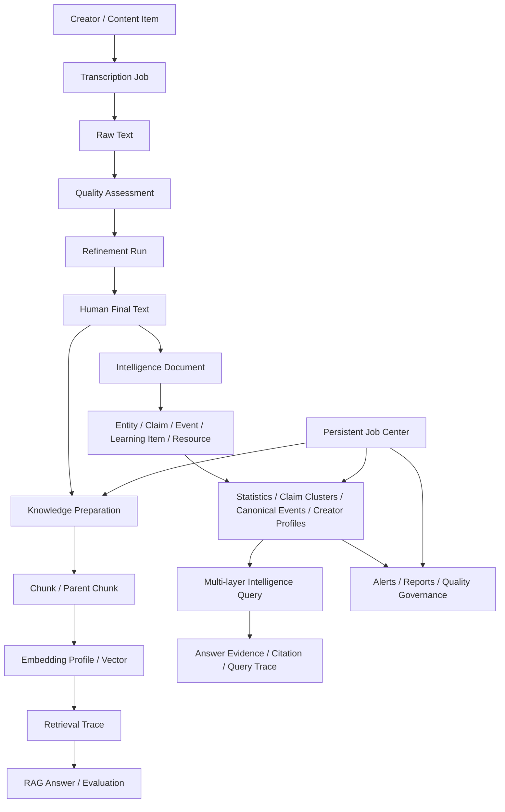

# CareerAgent Architecture

## 1. Design goals

CareerAgent is organized as a modular monolith. This keeps single-user local deployment simple while preserving clear extraction boundaries for future worker or service separation.

Key goals:

1. local-first data ownership;
2. reproducible and observable AI pipelines;
3. incremental processing instead of full recomputation;
4. evidence traceability from generated answers and reports back to source content;
5. swappable collection, model, database and retrieval providers;
6. explicit human review for risky text transformations;
7. persistent execution state for long-running data and model tasks.

## 2. Domain modules

```text
app/modules/
├── collection/       Public content discovery, creator metadata, incremental runs
├── transcription/    Video ASR, image OCR, article extraction, batch execution
├── refinement/       Cleaning, terminology correction, LLM refinement, structure extraction
├── knowledge_base/   Chunking, embedding, indexing, retrieval, cited RAG, evaluation
├── intelligence/     Materialization, statistics, clustering, alerts, reports, profiles, QA
├── jobs/             Persistent jobs, locks, progress, cancellation, retry and recovery
└── local_models/     Ollama installation, model pull, configuration and health checks
```

Most domain modules follow:

```text
Router → Service → Repository / Provider → Database or external runtime
```

Pydantic schemas define API boundaries. SQLAlchemy models define persisted state. Providers isolate unstable external systems.

## 3. Core data flow



## 4. Persistence

### PostgreSQL mode

The standard mode uses PostgreSQL 17 and pgvector:

- Alembic controls schema evolution;
- vectors are stored in pgvector columns;
- HNSW indexes are created for compatible embedding dimensions;
- application tables preserve source, trace, quality, evaluation and intelligence relations;
- job state and resource locks survive browser refresh and application restart;
- Docker Compose binds PostgreSQL only to localhost.

### SQLite mode

SQLite remains available for lightweight demonstrations and local development. Vector retrieval may fall back to in-process exact search depending on selected backend capabilities.

## 5. Retrieval architecture

```text
Query
→ Query classification
→ Dense and/or BM25 candidates
→ Weighted hybrid or RRF fusion
→ MMR source diversification
→ Optional local/API reranker
→ Parent context recovery
→ Evidence compression and token budget
→ Low-confidence gate
→ Cited answer
```

Index identities include provider, model, dimensions, chunking configuration and source signatures. Changes invalidate related caches.

## 6. Multi-layer intelligence query architecture

The intelligence query path routes by intent and combines heterogeneous evidence without flattening source semantics:

```text
User Question
→ Intent Classification
→ Layer Selection
   ├── Raw chunks
   ├── Claims
   ├── Claim clusters
   ├── Canonical events
   ├── Statistics
   ├── Creator profiles
   └── Learning resources
→ Layer-specific retrieval and scoring
→ Cross-layer fusion
→ Evidence gate
→ Answer generation with layer-labelled citations
→ Persistent query/candidate/citation trace
```

Normal RAG remains isolated for source-grounded lookups. Industry analysis uses structured layers for trend, consensus, disagreement, event and creator questions. Automatic mode selects a route before retrieval.

## 7. Intelligence architecture

The intelligence layer materializes normalized relations while preserving evidence links:

```text
Final Text
→ IntelligenceDocument
→ EntityMention / Claim / Event / LearningItem / Resource
```

Derived systems include:

- daily statistics and trend signals;
- claim clustering and human pair labeling;
- canonical event deduplication;
- explainable watchlist alerts;
- deterministic report skeletons with optional LLM editing;
- creator profiles and claim evolution timelines;
- persistent data-quality issues and performance diagnostics.

## 8. Background job architecture

Long-running manual operations are represented as database-backed jobs:

```text
Request
→ Idempotency key
→ Request lock + resource locks
→ Queued / Running
→ Progress events and heartbeat
→ Succeeded / Failed / Cancelled / Interrupted
```

The job center supports cooperative cancellation, retry, restart recovery and shared-resource serialization. It remains manually triggered; v1.23.0 does not include a scheduler or autonomous pipeline.

## 9. Observability and safety

- collection, transcription, refinement, indexing, intelligence and job flows record status and trace identifiers;
- rotating JSONL logs redact cookies, tokens and signing parameters;
- diagnostics export excludes browser profiles and secrets;
- original text is never overwritten by model output;
- high-risk edits require human review;
- cleanup APIs are allowlisted and require explicit user action;
- evidence gating prevents unsupported deterministic claims.

## 10. Deployment evolution

The modular monolith is appropriate for a single-user local application. Potential extraction boundaries are:

- collection workers;
- GPU transcription workers;
- embedding/reranking workers;
- scheduled intelligence workers;
- API/UI deployment with authentication and workspace isolation.

The detailed implementation notes are preserved in [docs/design/DETAILED_ARCHITECTURE.md](docs/design/DETAILED_ARCHITECTURE.md).
