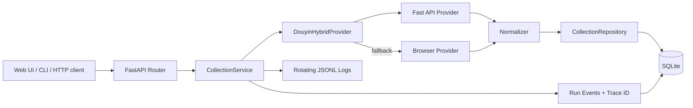

# CareerAgent Collector Architecture

## 1. Why a modular monolith

The project is currently maintained by a single developer and runs locally. A modular monolith provides clear domain boundaries without introducing premature deployment, authentication, distributed tracing, and message-consistency overhead.

```text
app/modules/
├── collection/       # implemented: public content discovery and ingestion
├── transcription/    # planned: audio/video transcription and document import
├── cleaning/         # planned: ASR correction and terminology normalization
├── knowledge/        # planned: knowledge cards, concepts, categories
├── retrieval/        # planned: chunks, embeddings, hybrid retrieval, reranking
├── learning/         # planned: quizzes, mastery, spaced review
├── incubation/       # planned: project backlog and acceptance criteria
├── interview/        # planned: role-based interview practice
└── observability/    # planned: prompt trace, evaluation, bad-case feedback
```

A module should be extracted into an independent service only when it has a real scaling, security, or deployment requirement.

## 2. Current request flow



## 3. Layer responsibilities

### API and UI

- validate transport-level input;
- call the application service;
- display structured success and error responses;
- never contain platform collection rules.

### CollectionService

- create and finalize collection runs;
- coordinate URL parsing and Provider execution;
- filter requested content types;
- normalize and persist creator/content data;
- emit task-stage events;
- translate failures into stable domain errors.

### Provider

- own platform-specific URLs, query parameters, pagination, signatures, cookies, selectors, and response parsing;
- return platform-neutral creator and content candidates;
- remain replaceable without changing the database or UI.

### Repository

- own database access and transactions;
- upsert creators and contents idempotently;
- preserve per-run ordering;
- calculate new, updated, and unchanged states;
- store run events for diagnosis.

## 4. Data backbone

```text
Creator
  └── ContentItem
        ├── CollectionRunItem
        └── future ContentAsset
              └── future CleanDocument
                    └── future KnowledgeCard
                          ├── Chunk / Embedding
                          ├── Quiz / LearningState
                          ├── ProjectBacklog
                          └── InterviewQuestion
```

The collection layer answers only “what public content exists and what changed.” It must not directly perform transcription, summarization, or RAG ingestion.

## 5. Identity and incremental processing

Content identity:

```text
platform + platform_content_id
```

Semantic content changes are detected with a fingerprint built from stable fields such as title, description, type, publication time, hashtags, music, and canonical URL. Volatile metrics such as likes and comments are intentionally excluded.

This enables downstream behavior:

```text
new      → create transcription and knowledge jobs
updated  → invalidate and rebuild affected downstream artifacts
unchanged → skip expensive reprocessing
```

## 6. Collection strategy

```text
DouyinHybridProvider
├── DouyinFastApiProvider
│   ├── load local session snapshot
│   ├── fetch creator profile
│   ├── paginate public works
│   └── retry with exponential backoff
└── DouyinBrowserProvider
    ├── open only the target creator profile
    ├── capture profile-list responses
    └── never open every work detail page
```

This design avoids the slow, error-prone behavior of opening each work individually while retaining a browser fallback for login or upstream changes.

## 7. Content-type boundary

The normalized model uses:

```text
video    canonical path /video/{id}
gallery  canonical path /note/{id}
article  canonical path /article/{id}
```

Long-form articles may also contain images, so article-specific markers must be evaluated before generic gallery detection.

## 8. Observability

Each run has:

- `run_id`: persistent database identity;
- `trace_id`: cross-module correlation identity;
- status, duration, requested and collected counts;
- error code, stage, retryability, and technical detail;
- ordered task events;
- rotating application logs.

Future transcription and knowledge jobs should inherit the originating `trace_id`.

## 9. Production evolution path

| Current | Future |
|---|---|
| SQLite | PostgreSQL |
| compatibility schema updates | Alembic migrations |
| in-request execution | Redis + ARQ/Dramatiq/Celery |
| local browser | isolated collector worker |
| local files | S3/MinIO object storage |
| local JSONL logs | OpenTelemetry / Langfuse |
| single user | users, workspaces, permissions, quotas |
| local Web UI | React/Vue + Tauri/WebView2 desktop shell |

The Provider, Service, Repository, stable IDs, content fingerprints, and trace IDs are designed to survive these transitions.
