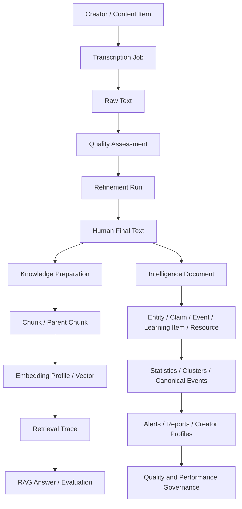

# CareerAgent Architecture

## 1. Design goals

CareerAgent is organized as a modular monolith. This keeps local deployment simple while preserving clear domain boundaries for future service extraction.

Key goals:

1. local-first data ownership;
2. reproducible and observable AI pipelines;
3. incremental processing instead of full recomputation;
4. evidence traceability from reports back to source content;
5. swappable collection, model, database, and retrieval providers;
6. explicit human review for risky transformations.

## 2. Domain modules

```text
app/modules/
├── collection/       Public content discovery, creator metadata, incremental runs
├── transcription/    Video ASR, image OCR, article extraction, batch execution
├── refinement/       Cleaning, terminology correction, LLM refinement, structure extraction
├── knowledge_base/   Chunking, embedding, indexing, retrieval, RAG, evaluation
├── intelligence/     Materialization, statistics, clustering, alerts, reports, profiles
└── local_models/     Ollama installation, configuration, pull, health checks
```

Each module follows a variant of:

```text
Router → Service → Repository / Provider → Database or External Runtime
```

Pydantic schemas define API boundaries. SQLAlchemy models define persisted state. Providers isolate unstable external systems.

## 3. Core data flow



## 4. Persistence

### PostgreSQL mode

The standard mode uses PostgreSQL 17 and pgvector:

- Alembic controls schema evolution;
- vectors are stored in pgvector columns;
- HNSW indexes are created per compatible embedding dimension;
- application tables preserve source, trace, quality, evaluation, and intelligence relations;
- Docker Compose binds PostgreSQL only to localhost.

### SQLite mode

SQLite remains available for lightweight demonstrations and local development. Vector retrieval may fall back to in-process exact search depending on the selected profile and backend capabilities.

## 5. Retrieval architecture

```text
Query
→ Query classification
→ Dense and/or BM25 candidates
→ Weighted hybrid or RRF fusion
→ MMR source diversification
→ Optional local/API reranker
→ Parent context recovery
→ Evidence compression and token budget
→ Low-confidence gate
→ Cited answer
```

Index identities include provider, model, dimensions, chunking configuration, and source signatures. Changes invalidate related caches.

## 6. Intelligence architecture

The intelligence layer does not discard source text. It materializes normalized relations while preserving evidence links:

```text
Final Text
→ IntelligenceDocument
→ EntityMention / Claim / Event / LearningItem / Resource
```

Derived systems include:

- daily statistics and trend signals;
- claim clustering and human pair labeling;
- canonical event deduplication;
- explainable watchlist alerts;
- deterministic report skeletons with optional LLM editing;
- creator profiles and claim evolution timelines;
- persistent data-quality issues and performance diagnostics.

## 7. Observability and safety

- every collection/transcription/refinement flow records task status and Trace ID;
- rotating JSONL logs redact cookies, tokens, and signing parameters;
- diagnostics export excludes browser profiles and secrets;
- original text is never overwritten by model output;
- high-risk edits require human review;
- cleanup APIs are allowlisted and require explicit user action.

## 8. Deployment evolution

The current modular monolith is appropriate for a single-user local application. Potential extraction boundaries are:

- collection workers;
- GPU transcription workers;
- embedding/reranking workers;
- scheduled intelligence jobs;
- API/UI deployment and authentication.

The detailed historical architecture notes are preserved in [docs/design/DETAILED_ARCHITECTURE.md](docs/design/DETAILED_ARCHITECTURE.md).
