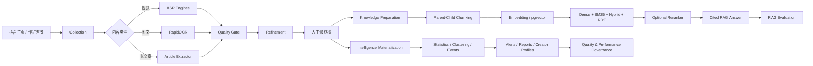

# CareerAgent

> 本地优先的 AI 内容处理、RAG 评测与行业情报分析平台：将抖音视频、图文和长文章转化为可清洗、可检索、可引用、可评测、可追踪的知识资产。

**当前版本：v1.21.0**

CareerAgent 面向 AI 学习、求职准备和行业研究场景，覆盖从公开内容采集到情报报告生成的完整数据链路：

```text
内容采集
→ 视频 ASR / 图文 OCR / 长文章正文提取
→ 文本质量门禁与安全纠错
→ 人工最终稿与知识结构化
→ PostgreSQL / pgvector 正式入库
→ Dense / BM25 / Hybrid / RRF / Reranker
→ 带引用知识库问答与 RAG 评测
→ 实体、观点、事件、学习项和资源关系化
→ 统计趋势、观点聚类、事件预警与行业报告
→ 博主画像、数据质量与性能治理
```

该仓库既是可运行的本地应用，也是面向 AI 应用开发、RAG 工程、Agent 工程、数据产品和 AI 产品岗位的作品集项目。

## 核心能力

### 1. 多源内容采集

- 单博主前 N 条公开作品采集；
- 多博主按自然日增量采集；
- 区分视频、普通图文和长文章；
- API-first，失败时只打开目标主页做浏览器兜底；
- `platform + aweme_id` 幂等去重；
- 任务、阶段事件、错误码、Trace ID 和诊断包全链路记录。

### 2. 视频、图文与文章文本化

| 内容类型 | 处理链路 |
|---|---|
| 视频 | 媒体解析 → 下载 → FFmpeg 提取音频 → ASR |
| 图文 | 图片下载 → RapidOCR → 文本合并 |
| 长文章 | 结构化字段 → 页面内嵌数据 → DOM 兜底 |

视频 ASR 支持 SenseVoiceSmall、Paraformer 和 faster-whisper，提供 GPU 自动检测、CPU 回退、批量任务、失败重试、模型复用和媒体缓存治理。

### 3. 文本质量门禁与纠错

- 规则质量评分和风险分层；
- 重复片段、异常字符、超长无标点句和术语风险检测；
- 双 ASR 模型交叉复核；
- 人工标准稿与 CER 评测；
- 原始稿、清洗稿、纠错稿和人工最终稿分层保存；
- Agent、RAG、Token、Prompt、MCP 等领域术语规范化；
- API 模型或 Ollama 本地 Qwen 保守纠错；
- 数字、URL、版本号、缩写和修改比例安全校验。

### 4. 本地优先知识库与带引用问答

- 父子分块和增量索引同步；
- API Embedding 与 Ollama 本地 Embedding；
- Dense、BM25、加权混合、RRF 和 MMR；
- Qwen3 Reranker 可选精排；
- 查询路由、父块回溯、相邻去重和动态证据压缩；
- 低置信度拒答；
- `[1]`、`[2]` 编号引用绑定真实来源；
- 检索结果、上下文、回答、引用、耗时和 Token 可追踪。

### 5. RAG 评测与优化闭环

- 参考答案、关键要点、拒答预期和调参集/测试集；
- 检索方案实验与端到端问答评测分离；
- 自动定位召回、排序、上下文、生成、引用和拒答问题；
- 历史运行作为回归基线；
- 通过率、正确性、忠实度、引用、耗时和 Token 对比；
- 统一检索默认配置可发布到正式问答链路。

### 6. 行业情报结构化与分析

文本最终稿可进一步关系化为：

- 实体与实体提及；
- 观点、事实、建议及证据；
- 事件及证据；
- 学习项、工具和资源；
- 内容主题、作者和发布时间。

在此基础上提供：

- 行业统计、时间趋势、来源集中度和实体排行；
- 观点聚类、共识/分歧分析、阈值扫描和人工评测；
- 事件归并、关注列表和可解释预警；
- 日报、周报和专题报告，支持 Word 导出；
- 博主画像、内容风格、主题聚焦度和观点演变；
- 数据质量问题追踪、数据库性能诊断和安全清理。

### 7. PostgreSQL、pgvector 与可运维性

- 默认支持 Docker Desktop 启动 PostgreSQL 17 + pgvector；
- SQLite 保留为轻量兼容模式；
- Alembic 数据库迁移；
- SQLite 到 PostgreSQL 数据迁移与备份；
- pgvector 向量存储和 HNSW 索引；
- 结构化日志轮转、敏感字段脱敏和诊断包导出；
- 数据库、模型、缓存、日志和导出目录可独立配置。

## 系统架构



应用采用模块化单体架构：

```text
app/
├── core/               # 配置、路径、日志、存储、密钥和计算环境
├── db/                 # SQLAlchemy Async、SQLite、PostgreSQL、pgvector
├── modules/
│   ├── collection/     # 单博主、多博主、增量采集和诊断
│   ├── transcription/  # 视频 ASR、图文 OCR、文章正文、批量任务
│   ├── refinement/     # 清洗、术语纠错、LLM 整理、知识结构化
│   ├── knowledge_base/ # 分块、索引、检索、问答、评测和优化
│   ├── intelligence/   # 统计、聚类、事件、预警、报告和画像
│   └── local_models/   # Ollama 部署、模型拉取与健康检查
├── api/                # FastAPI 路由聚合
└── web/                # 原生 HTML / CSS / JavaScript 管理界面
```

详细设计见 [ARCHITECTURE.md](ARCHITECTURE.md)。

## 技术栈

- **Backend:** FastAPI, Pydantic, SQLAlchemy Async, HTTPX
- **Database:** PostgreSQL 17, pgvector, Alembic, SQLite compatibility mode
- **Browser automation:** Playwright
- **ASR:** FunASR, SenseVoiceSmall, Paraformer, faster-whisper
- **OCR:** RapidOCR, ONNX Runtime
- **Local models:** Ollama, Qwen3.5, Qwen3 Embedding, Qwen3 Reranker
- **Retrieval:** Dense retrieval, BM25, weighted hybrid, RRF, MMR
- **Export:** python-docx
- **Testing:** pytest, pytest-asyncio, Ruff, GitHub Actions

## 快速开始

### Windows 普通用户

要求：

- Windows 10/11；
- Python 3.11 或 3.12；
- Docker Desktop（使用默认 PostgreSQL 模式时）；
- 可用网络；
- 使用 GPU 时需安装可用的 NVIDIA 驱动。

步骤：

1. 克隆或下载仓库并完整解压；
2. 启动 Docker Desktop；
3. 双击 `CareerAgent_Start.bat`；
4. 首次启动选择运行数据与导出目录；
5. 启动器自动创建虚拟环境、准备数据库、安装依赖并启动服务；
6. 浏览器自动打开本地管理页面；
7. 首次采集前，在页面中完成抖音登录。

> ASR、Embedding、Reranker 和 Ollama 模型权重按需下载，不包含在仓库中。

### SQLite 轻量模式

不使用 Docker 时，可复制 `.env.example` 为 `.env`，并设置：

```env
CAREERAGENT_DATABASE_MODE=sqlite
```

### 开发者模式

```bash
python -m venv .venv

# Windows
.venv\Scripts\activate

# macOS / Linux
source .venv/bin/activate

pip install -r requirements.txt
playwright install chromium

# SQLite 开发模式
set CAREERAGENT_DATABASE_MODE=sqlite
uvicorn app.main:app --reload
```

默认访问：`http://127.0.0.1:8000`

本地 ASR 依赖体积较大，按需安装：

```bash
pip install -r requirements-asr.txt
```

PyTorch 和 torchaudio 建议交给 `bootstrap.py` 根据硬件安装，避免 CUDA wheel 被普通 pip 依赖覆盖。

## 测试

```bash
pip install -r requirements-ci.txt
pytest -q
ruff check app tests bootstrap.py careeragent_location.py configure_storage.py database_bootstrap.py
python -m compileall -q app tests bootstrap.py
node --check app/web/static/app.js
```

离线测试不会访问真实抖音账号、远程模型或本地 GPU。需要真实登录态、GPU、模型和 Docker 的场景不在 CI 中执行。

## 数据与隐私

以下本地数据不会进入 Git 仓库：

- `.env`、API Key 和本地服务密钥；
- 抖音 Cookie 与浏览器登录目录；
- SQLite / PostgreSQL 数据目录和备份；
- ASR、Embedding、Reranker 与 Ollama 模型；
- 视频、音频、OCR 图片和媒体缓存；
- 日志、诊断包、Word/CSV/JSON 等用户导出文件。

这些路径已由 `.gitignore` 排除。发布前仍建议执行 [发布检查清单](docs/RELEASE_CHECKLIST.md)。

## 文档

- [系统架构](ARCHITECTURE.md)
- [PostgreSQL 与 pgvector](docs/design/DATABASE_POSTGRESQL.md)
- [计算环境设计](docs/design/COMPUTE_ENVIRONMENT.md)
- [质量评估设计](docs/design/QUALITY_EVALUATION.md)
- [文本清洗与纠错](docs/design/TEXT_REFINEMENT.md)
- [存储设计](docs/design/STORAGE_OPTIMIZATION.md)
- [错误码](docs/design/ERROR_CODES.md)
- [路线图](docs/ROADMAP.md)
- [作品集与面试表达](docs/PORTFOLIO_GUIDE.md)
- [GitHub 上传教程](docs/GITHUB_UPLOAD_GUIDE.md)
- [完整开发历史](docs/releases/DEVELOPMENT_HISTORY.md)

## 项目边界与合规

- 当前采集适配重点为抖音公开内容，平台接口变化后可能需要更新；
- 登录与验证码必须由用户本人完成，项目不绕过验证；
- 使用者应遵守平台条款、版权、隐私和所在地法律；
- 自动质量指标、聚类、预警和模型生成内容均不能替代人工判断；
- 上游模型权重不随仓库发布，使用前需核对各自许可证和服务条款。

## License

本项目采用 [Apache License 2.0](LICENSE)。第三方组件、适配代码和模型仍受各自上游许可证约束，详见 [THIRD_PARTY_NOTICES.md](THIRD_PARTY_NOTICES.md)。
