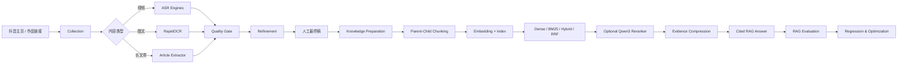

# CareerAgent

> 面向 AI 学习与求职场景的本地优先内容处理与 RAG 评测平台：把抖音视频、图文和长文章转换为可清洗、可检索、可引用、可评测的知识资产。

**当前版本：v1.9.3**

CareerAgent 已实现从公开内容采集到本地 RAG 回归评测的完整工程链路：

```text
内容采集
→ 视频 ASR / 图文 OCR / 长文章正文提取
→ 文本质量评估
→ 清洗、术语纠错与人工最终稿
→ 知识入库准备
→ 父子分块与 Embedding
→ Dense / BM25 / Hybrid / RRF
→ 可选 Qwen3 Reranker
→ 带引用知识库问答
→ 端到端 RAG 评测、回归对比与参数优化
```

该项目适合作为 AI 应用开发、RAG 工程、Agent 工程和 AI 产品方向的作品集，也可作为个人 AI 学习资料处理工具。

## 核心能力

### 1. 多源内容采集

- 输入单个抖音博主主页，采集前 N 条公开作品；
- 多博主按完整自然日做增量采集；
- 区分视频、普通图文和长文章；
- API-first + 浏览器主页兜底；
- `platform + aweme_id` 幂等去重；
- 采集任务、错误码、阶段事件和 Trace ID 全链路记录。

### 2. 自动文本化

| 内容类型 | 处理链路 |
|---|---|
| 视频 | 媒体解析 → MP4 下载 → FFmpeg 提取 WAV → ASR |
| 图文 | 图片下载 → RapidOCR 本地 OCR → 文本合并 |
| 长文章 | 结构化接口 → 页面内嵌数据 → 隐藏浏览器 DOM 兜底 |

视频 ASR 支持 SenseVoiceSmall、Paraformer 和 faster-whisper，并提供 CUDA 自动检测、CPU 回退、批量任务、失败项重试与模型进程内复用。

### 3. 文本质量门禁

- 自动质量评分和风险分层；
- 重复片段、异常字符、超长无标点句检测；
- 双 ASR 模型交叉复核；
- 人工标准稿与 CER 计算；
- 原始文本、清洗稿、纠错稿和人工最终稿分别保存；
- 高风险文本可阻止进入知识库。

### 4. 文本清洗与纠错

- 确定性格式清洗；
- Agent、RAG、Token、Prompt、MCP 等领域术语规范化；
- 自定义术语词表；
- OpenAI 兼容 API 可读化整理；
- Ollama 本地 `qwen3.5:4b` 保守纠错；
- 数字、版本号、URL 和修改比例安全校验；
- 人工编辑并确认最终稿。

### 5. 本地优先知识库

- 父子分块：短子块负责精准召回，较长父块负责回答上下文；
- Embedding 文本加入标题、作者、小节、主题和关键词等身份信息；
- API Embedding 与 Ollama 本地 Embedding；
- `qwen3-embedding:0.6b` 与 `qwen3-embedding:4b` 可分别建立索引；
- Dense、BM25、加权混合、RRF 和 MMR；
- Qwen3-Reranker-0.6B / 4B 本地精排；
- 查询向量、BM25、基础排名、上下文和答案缓存，索引变化时自动失效。

### 6. 带引用的知识库问答

- 规则查询路由识别精确事实、概念题、多来源题和追问；
- 动态证据压缩、父块回溯、重叠去重、同文档限流和字符预算；
- 低置信度证据门禁，资料不足时拒答；
- API 大模型或本地 Ollama 模型手动选择；
- 本地 Ollama 支持 NDJSON 流式输出；
- `[1]`、`[2]` 编号引用绑定真实来源；
- 保存检索结果、上下文、回答、引用、耗时和 Token。

### 7. RAG 评测与优化

- 参考答案、关键要点、拒答预期和调参集/测试集划分；
- 自动诊断召回、排序、上下文选择、生成、引用和拒答问题；
- 端到端评测支持历史运行作为回归基线；
- 展示通过率、正确性、忠实度、引用、耗时、Token 和退化题；
- 检索方案实验与端到端问答评测明确分离；
- 统一检索默认配置覆盖单题、批量评测、问答和方案对比；
- 精排比例与题数安全上限，避免本地 Reranker 近乎全量运行。

### 8. 本地模型与存储管理

- Windows 下 Ollama 便携版一键部署；
- `qwen3.5:4b` 与 `qwen3-embedding:4b` 串行下载和测试；
- Ollama、ASR 模型和 PyTorch/CUDA 环境相互隔离；
- 数据库、模型、缓存、日志和导出目录可独立配置；
- 运行日志轮转、诊断包导出和敏感字段脱敏。

## 系统架构



应用采用模块化单体结构：

```text
app/
├── core/               # 配置、路径、日志、存储、密钥和计算环境
├── db/                 # SQLAlchemy Async 与 SQLite
├── modules/
│   ├── collection/     # 单博主、多博主、增量采集与诊断
│   ├── transcription/  # 视频 ASR、图文 OCR、文章正文、批量任务
│   ├── refinement/     # 清洗、术语纠错、LLM 整理、人工最终稿
│   ├── knowledge_base/ # 入库、Embedding、检索、问答、评测与优化
│   └── local_models/   # Ollama 配置、部署、拉取与测试
├── api/                # FastAPI 路由聚合
└── web/                # 原生 HTML/CSS/JavaScript 管理界面
```

详细设计见 [ARCHITECTURE.md](ARCHITECTURE.md)。

## 技术栈

- **Backend:** FastAPI, Pydantic, SQLAlchemy Async, SQLite, HTTPX
- **Browser automation:** Playwright
- **ASR:** FunASR, SenseVoiceSmall, Paraformer, faster-whisper
- **OCR:** RapidOCR, ONNX Runtime
- **Local LLM:** Ollama, Qwen3.5, Qwen3 Embedding
- **Retrieval:** Dense retrieval, BM25, weighted hybrid, RRF, MMR, Qwen3 Reranker
- **Document export:** python-docx
- **Testing:** pytest, pytest-asyncio, Ruff

## 快速开始

### Windows 普通用户

要求：

- Windows 10/11；
- Python 3.11 或 3.12；
- 可用网络；
- 使用 GPU 时需要正常安装 NVIDIA 驱动。

步骤：

1. 下载并完整解压仓库；
2. 双击 `CareerAgent_Start.bat`；
3. 首次启动选择运行数据和导出目录；
4. 启动器自动创建虚拟环境、安装依赖、检测 GPU 并安装 Chromium；
5. 浏览器自动打开本地管理页面；
6. 首次采集前，在页面中完成抖音登录。

> ASR、Ollama、Reranker 和模型权重按需下载，不包含在 GitHub 仓库中。

### 开发者模式

```bash
python -m venv .venv

# Windows
.venv\Scripts\activate

# macOS / Linux
source .venv/bin/activate

pip install -r requirements.txt
playwright install chromium
uvicorn app.main:app --reload
```

默认访问：`http://127.0.0.1:8000`

本地 ASR 依赖体积较大，按需安装：

```bash
pip install -r requirements-asr.txt
```

PyTorch 和 torchaudio 建议由 `bootstrap.py` 根据硬件安装，避免 CUDA 版本被普通 pip 依赖覆盖。

## 测试

```bash
pip install -r requirements-ci.txt
pytest -q
ruff check app tests bootstrap.py careeragent_location.py configure_storage.py migrate_to_lightweight.py
python -m compileall -q app tests bootstrap.py
node --check app/web/static/app.js
```

当前 GitHub 发布包在全新最小 CI 环境中完成 `94 passed`。测试均为离线或模拟测试，不会访问真实抖音账号、远程模型或本地 GPU。

## 数据与隐私

CareerAgent 是本地优先应用。以下内容不会进入 Git 仓库：

- `.env` 和 API Key；
- 抖音 Cookie 和浏览器登录目录；
- SQLite 数据库；
- ASR、Embedding、Reranker 和 Ollama 模型；
- 视频、音频和 OCR 图片缓存；
- 日志、诊断包和用户导出文件。

这些路径已由 `.gitignore` 排除。上传 GitHub 前仍建议执行 [发布检查清单](docs/RELEASE_CHECKLIST.md)。

## 文档

- [系统架构](ARCHITECTURE.md)
- [Windows 使用说明](USER_GUIDE.txt)
- [计算环境设计](docs/design/COMPUTE_ENVIRONMENT.md)
- [质量评估设计](docs/design/QUALITY_EVALUATION.md)
- [文本清洗与纠错](docs/design/TEXT_REFINEMENT.md)
- [存储设计](docs/design/STORAGE_OPTIMIZATION.md)
- [错误码](docs/design/ERROR_CODES.md)
- [路线图](docs/ROADMAP.md)
- [作品集与面试表达](docs/PORTFOLIO_GUIDE.md)
- [GitHub 上传教程](docs/GITHUB_UPLOAD_GUIDE.md)
- [版本发布说明](docs/releases/)

## 项目边界

- 当前重点是抖音公开内容，不保证平台接口长期稳定；
- 浏览器验证和登录需由用户本人完成，项目不绕过验证码；
- 使用者应遵守平台条款、版权、隐私和所在地法律；
- 模型生成内容和自动质量指标不能替代人工复核；
- 上游模型权重不随仓库发布，使用前需核对各自许可证。

## License

Apache License 2.0。第三方组件和模型仍受各自上游许可证约束，详见 [THIRD_PARTY_NOTICES.md](THIRD_PARTY_NOTICES.md)。
