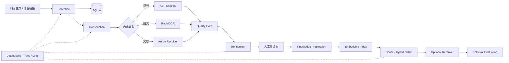

# CareerAgent

<p align="center">
  <strong>面向 AI 求职学习场景的多源内容采集、文本化、清洗与检索评测平台</strong>
</p>

<p align="center">
  
  
  
  
  
</p>

> CareerAgent 将碎片化的抖音 AI 学习内容，转化为可追踪来源、可评估质量、可人工确认、可建立索引并可进行检索实验的本地知识资产。

## 项目定位

CareerAgent 不是单纯的“视频链接提取器”或“语音转文字 Demo”。它实现了一条面向后续 RAG 与学习 Agent 的数据生产链路：

```text
公开内容采集
→ 视频 ASR / 图文 OCR / 长文章解析
→ 质量评估与人工标准稿
→ 文本清洗、术语纠错与可选 LLM 可读化
→ 知识入库准备
→ Embedding 索引
→ Dense / Hybrid / RRF 检索
→ 可选 Reranker
→ 单选、多选测试集评测
```

当前版本：**v1.4.2**。

## 核心能力

### 1. 抖音内容采集

- 输入单个博主主页，采集前 N 条公开作品；
- 多博主按完整自然日批量采集；
- 区分视频、普通图文和长文章；
- API-first，高速分页；接口失败时仅打开目标主页做浏览器兜底；
- 作者、作品、批次和任务阶段幂等入库；
- 统一错误码、Trace ID、失败重试和诊断包导出。

### 2. 多类型内容文本化

- 视频：SenseVoiceSmall、Paraformer、Whisper；
- 图文：RapidOCR；
- 长文章：结构化接口、页面 JSON 与隐藏浏览器 DOM 多级降级；
- 单条或后台批量处理；
- 同一模型进程内复用，受控并发下载、音频提取与推理；
- NVIDIA GPU 自动检测，Whisper CUDA 不可用时自动回退 CPU/int8。

### 3. ASR 质量门禁

- 自动质量评分与风险分层；
- 异常字符、重复片段、无标点长句、字数密度和疑似术语误识别检测；
- 可选第二 ASR 模型交叉复核；
- 支持人工标准稿和中文 CER；
- 原始文本、清洗稿、纠错稿、最终稿分版本保存，永不覆盖原始结果。

### 4. 文本清洗与纠错

- 统一处理 SenseVoice、Paraformer、Whisper 的分段与段落重建；
- 基础格式清洗；
- AI 领域术语词典纠错；
- 可选本地轻量纠错模型；
- 可选 OpenAI-compatible API 可读化整理；
- 数字、URL、版本号和修改比例安全检查；
- 支持人工编辑并标记最终稿。

### 5. 知识库与检索评测

- 对人工最终稿或确认文本进行知识入库准备；
- Embedding API 多模型索引；
- Dense、Hybrid、RRF 三种检索策略；
- BM25 与向量召回融合；
- 多来源 MMR 去重与结果多样化；
- 可配置 Reranker 使用范围；
- 多索引横向比较；
- 单选与多选测试集；
- Hit@K、Recall@K、Precision@K、Full Hit@5 等指标；
- 记录检索耗时、Embedding/Rerank 请求次数与策略参数。

### 6. 本地优先与可观测性

- FastAPI + SQLite，本机 `127.0.0.1` 运行；
- 数据、模型、浏览器登录状态和导出目录可独立配置；
- Windows DPAPI 加密保存可选 API Key；
- JSONL 结构化日志、日志轮转、任务 Trace 和诊断中心；
- 诊断包默认不包含 Cookie、Token、浏览器目录和明文 API Key。

## 系统架构



详细设计见 [ARCHITECTURE.md](ARCHITECTURE.md)。

## 技术栈

| 层 | 技术 |
|---|---|
| Web/API | FastAPI、Uvicorn、原生 HTML/CSS/JavaScript |
| 数据层 | SQLAlchemy Async、SQLite、aiosqlite |
| 网络与浏览器 | HTTPX、Playwright |
| 视频 ASR | FunASR、SenseVoiceSmall、Paraformer、faster-whisper |
| 图文与文章 | RapidOCR、ONNX Runtime、BeautifulSoup、Chromium DOM |
| 文本处理 | RapidFuzz、Transformers、OpenAI-compatible API |
| 检索 | Embedding API、BM25、Dense、Hybrid、RRF、MMR、Reranker |
| 质量与诊断 | CER、结构化错误码、Trace ID、JSONL 日志、诊断 ZIP |
| 测试 | Pytest、Ruff、GitHub Actions |

## 快速开始

### 推荐环境

- Windows 10/11；
- Python 3.11 或 3.12；
- 首次安装需要网络；
- 本地 ASR 可使用 CPU；NVIDIA GPU 可显著提升速度；
- 模型和运行环境可能占用数 GB 到十余 GB，请先确认磁盘空间。

### Windows 一键启动

1. 克隆或下载仓库；
2. 双击 `CareerAgent_Start.bat`；
3. 首次启动选择运行数据与导出目录；
4. 启动器自动创建环境、安装依赖和 Chromium；
5. 浏览器自动打开 `http://127.0.0.1:8000/`。

首次采集前，在网页中打开抖音登录窗口并人工完成登录。后续登录状态保存在用户选择的数据目录，不在代码仓库中。

### 开发模式

```bash
python -m venv .venv

# Windows
.venv\Scripts\activate

# macOS / Linux
source .venv/bin/activate

pip install -r requirements-dev.txt
playwright install chromium
uvicorn app.main:app --reload
```

只在需要本地 ASR/OCR/纠错模型时安装：

```bash
pip install -r requirements-asr.txt
```

> `bootstrap.py` 会在 Windows 上根据硬件单独安装合适的 PyTorch/torchaudio。直接手动安装 ASR 依赖时，请自行确认 CPU/CUDA 版本。

## 项目结构

```text
career-agent/
├── app/
│   ├── api/v1/                   # API 汇总与系统接口
│   ├── core/                     # 配置、存储、日志、计算环境、密钥保护
│   ├── db/                       # Async SQLAlchemy 会话与迁移兼容
│   ├── modules/
│   │   ├── collection/           # 单博主/多博主采集、任务日志、内容状态
│   │   ├── transcription/        # ASR、OCR、文章解析、批量任务、质量评估
│   │   ├── refinement/           # 清洗、术语纠错、API/本地模型整理、最终稿
│   │   └── knowledge_base/       # 切分、Embedding、混合检索、Rerank、评测
│   └── web/                      # 本地 Web 工作台
├── tests/                        # 单元与服务测试
├── docs/                         # 架构、作品集、上传、路线图文档
├── bootstrap.py                  # Windows 环境检测与一键安装
├── CareerAgent_Start.bat         # 用户启动入口
├── requirements.txt              # 核心运行依赖
├── requirements-asr.txt          # 可选本地模型依赖
└── requirements-dev.txt          # 开发与测试依赖
```

## 数据与隐私

公开仓库**不会**包含：

- `.env`；
- 抖音 Cookie 和浏览器用户目录；
- SQLite 数据库；
- API Key；
- 模型权重；
- 视频、音频、OCR 图片；
- 日志、诊断包和导出文档。

这些文件已由 `.gitignore` 排除。提交前仍建议运行：

```bash
git status
```

并确认没有个人数据或密钥进入暂存区。详见 [SECURITY.md](SECURITY.md)。

## 测试与代码检查

```bash
pytest -q
ruff check .
python -m compileall -q app tests bootstrap.py
```

GitHub Actions 会在 Python 3.11 和 3.12 上执行核心单元测试与静态检查。涉及真实抖音登录、网络接口、GPU、本地模型下载的测试不在 CI 中执行。

## API

启动后可访问：

- Web 工作台：`http://127.0.0.1:8000/`
- Swagger：`http://127.0.0.1:8000/docs`
- 健康检查：`http://127.0.0.1:8000/health`

主要 API 域：

- `/api/v1/collections/*`
- `/api/v1/transcriptions/*`
- `/api/v1/refinements/*`
- `/api/v1/knowledge-base/*`
- `/api/v1/system/*`

## 当前边界

- Windows-first，本项目尚未把所有本地安装与 GPU 路径逻辑适配到 Linux/macOS；
- 抖音接口和页面结构可能变化，采集模块需要持续维护；
- 本地模型首次下载体积较大；
- Embedding、Reranker 和 LLM API 的费用、限额与数据政策由用户选择的服务商决定；
- 当前是本地单用户应用，不包含 SaaS 多租户、权限系统和云端任务调度；
- 项目仅用于处理用户有权访问的公开内容，使用者应遵守平台条款、版权、隐私和当地法律。

## 路线图

- [x] 多源公开内容采集
- [x] 视频/图文/文章自动文本化
- [x] ASR 质量评估与 CER
- [x] 清洗、术语纠错和人工最终稿
- [x] Embedding 多索引与混合检索
- [x] 单选/多选检索测试集评测
- [ ] 带引用的 RAG 回答生成
- [ ] Prompt、召回、Rerank、Citation 全链路 Trace
- [ ] 学习掌握度与间隔复习
- [ ] 面试陪练与项目 Backlog 孵化

完整规划见 [docs/ROADMAP.md](docs/ROADMAP.md)。

## 作品集说明

这个仓库适合展示以下能力：

- 从真实问题出发设计端到端 AI 数据链路；
- 异步后端、任务状态、幂等入库与失败恢复；
- 多模型本地推理与 CPU/GPU 运行环境管理；
- ASR/OCR 脏文本治理、质量评测和人工在环；
- Dense/BM25/RRF/Reranker 检索实验与指标化评估；
- 日志、Trace、错误码和诊断包等生产化意识。

简历与面试表达见 [docs/PORTFOLIO_GUIDE.md](docs/PORTFOLIO_GUIDE.md)。

## 许可证与第三方声明

项目主体采用 [Apache License 2.0](LICENSE)。部分签名辅助代码和第三方组件受各自许可证约束，详见 [THIRD_PARTY_NOTICES.md](THIRD_PARTY_NOTICES.md) 与 [NOTICE](NOTICE)。模型权重不随仓库分发，使用前请核对对应模型卡和许可证。

## 免责声明

本项目仅供学习、研究和个人知识管理使用，不隶属于、未获抖音或相关服务商官方认可。请勿绕过访问控制、批量滥用接口、侵犯版权或采集非公开数据。使用者对自己的账号、API 服务、数据来源与使用行为负责。
