# CareerAgent

> A local-first content processing and RAG evaluation platform for AI learning and career preparation.

**Current version: v1.9.3**

CareerAgent turns public Douyin videos, image posts, and long-form articles into traceable knowledge assets:

```text
Collection
→ ASR / OCR / article extraction
→ quality gate
→ text refinement and human final draft
→ knowledge preparation
→ parent-child chunking and embeddings
→ hybrid retrieval and optional reranking
→ cited RAG answers
→ evaluation, regression comparison, and optimization
```

## Highlights

- API-first Douyin collection with browser fallback and idempotent persistence;
- SenseVoice, Paraformer, and faster-whisper transcription pipelines;
- RapidOCR image-post extraction and long-article parsing;
- quality scoring, dual-ASR review, and CER against human references;
- deterministic cleanup, domain terminology correction, API rewriting, and local Ollama refinement;
- parent-child chunks, enriched embedding text, Dense/BM25/weighted hybrid/RRF/MMR retrieval;
- separate indexes for `qwen3-embedding:0.6b` and `qwen3-embedding:4b`;
- local Qwen3-Reranker-0.6B/4B with batch safety limits;
- evidence compression, low-confidence gating, numbered citations, and local streaming answers;
- retrieval experiments, end-to-end RAG evaluation, historical regression baselines, and failure diagnosis;
- local SQLite persistence, rotating logs, trace IDs, and diagnostic exports.

## Architecture

```mermaid
flowchart LR
    A[Public Content] --> B[Collection]
    B --> C[ASR / OCR / Article Extraction]
    C --> D[Quality Gate]
    D --> E[Refinement]
    E --> F[Knowledge Preparation]
    F --> G[Parent-Child Chunking]
    G --> H[Embedding & Index]
    H --> I[Hybrid Retrieval]
    I --> J[Optional Reranker]
    J --> K[Evidence Compression]
    K --> L[Cited RAG Answer]
    L --> M[Evaluation & Regression]
```



## Quick start

### Windows

1. Install Python 3.11 or 3.12.
2. Download and extract the repository.
3. Double-click `CareerAgent_Start.bat`.
4. Select local data and export directories on first launch.
5. Complete Douyin login in the Playwright Chromium window before collection.

Models, browser binaries, ASR runtimes, and Ollama assets are downloaded on demand and are not committed to the repository.

### Developer setup

```bash
python -m venv .venv
source .venv/bin/activate  # Windows: .venv\Scripts\activate
pip install -r requirements.txt
playwright install chromium
uvicorn app.main:app --reload
```

Optional ASR dependencies:

```bash
pip install -r requirements-asr.txt
```

## Checks

```bash
pip install -r requirements-ci.txt
pytest -q
ruff check app tests bootstrap.py careeragent_location.py configure_storage.py migrate_to_lightweight.py
python -m compileall -q app tests bootstrap.py
node --check app/web/static/app.js
```

## Privacy

The repository excludes API keys, browser sessions, cookies, SQLite databases, logs, diagnostics, model weights, media caches, and user exports. Review `docs/RELEASE_CHECKLIST.md` before publishing a fork.

## License

Apache License 2.0. Third-party software and model weights remain subject to their respective upstream licenses. See `THIRD_PARTY_NOTICES.md`.
